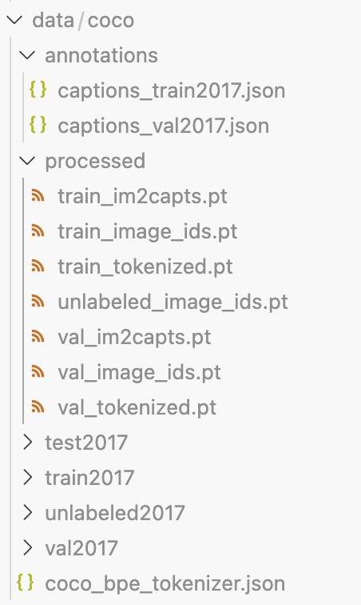
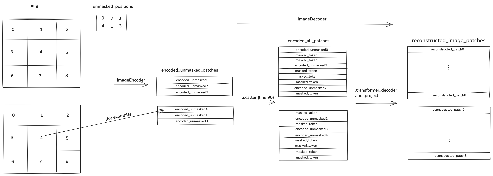

## Introduction

Welcome to my image captioning project! I made this project to improve my understanding of [*Masked Autoencoders Are Scalable Vision Learners*](https://arxiv.org/abs/2111.06377) (He et al., 2021), image captioning, and also for fun. In this writeup I will go into detail about the current methodology and implementation used to train a ViT + decoder model on the MS COCO dataset, achieving clear and structured descriptions given images as input. Everything here is built from scratch, and I did not use any pre-trained models. If you like seeing nitty gritty implementation details, then this writeup is for you. 

In a nutshell, the model is a caption decoder hooked up to a ViT. The ViT is first trained on the COCO images only, while being part of a masked autoencoder. This allows it to learn complex features from the images. Next, the full captioner is trained on images + captions, where the captions are tokenized using byte pair encoding and a vocabulary size of 5000. To avoid catastrophic forgetting, the encoder part of the captioner uses small learning rates and is slowly unfrozen during training.

It is important to follow the source code alongside this writeup. I recommend opening it up in another tab and viewing them side by side. There are also numbered examples in `code_snippets.ipynb` which I shall refer to directly.

## The Dataset

The 2017 MS COCO captioning dataset consists of 118K training and 5K validation images. Each image is equipped with 5 human written captions, typically 20 words long. Furthermore, the dataset contains 123K unlabeled images and 41K test images. I'll now describe the code in `process_coco.py`. This script is run only once, and it is the first script that must be executed.

In section 1, you will find code that downloads the train, val, test, and unlabeled images, each into their own folder. It also downloads the annotations as two separate .json files (training and validation). 

Note: I abstracted away all file locations in a dict named "paths", which you can find in paths.py. 

In section 2, I instantiate a Hugging Face tokenizer which uses byte pair encodings, and then train it on the training captions only. This tokenizer removes accents and capitalization in order to reduce the necessary vocabulary size. The object `train_captions` on line 106 is a list of strings (captions), and Example 1 should clarify the structure of the annotations file. 

Finally, section three tokenizes every caption and creates several data structures. Have a look at examples 2-4 in code_snippets.ipynb to understand what is contained in these structures. Example 2 also illustrates how load and display an image, and how to use the tokenizer to decode.

The data directory should look like so after running process_coco.py:

## The Datasets and DataLoaders

The Dataset definitions are found in `coco_loader.py`. Their implementations, and in particular the `__getitem__` methods, depend heavily on the data structures generated in `process_coco.py`. You'll find three distinct Dataset classes: `CaptFirstDataset`, `ImgFirstDataset`, and `ImageOnlyDataset`. Have a look at the docstrings for details.

Each Dataset serves a different purpose in the training and evaluation pipeline.

- `CaptFirstDataset`: The captioner training loop needs it to iterate over over all (image, caption) pairs. Note that each image appears in 5 different pairs as there are 5 captions per image. 

- `ImageFirstDataset`: The BLEU score evaluation loop needs it to iterate over all (image, [5 captions], image_id) triplets. 

- `ImageOnlyDataset`: The MAE training loop needs it to iterate over all images.

The corresponding data loaders are returned by `get_coco_loader()`, whose args specify the desired type of data loader. Examples 5 through 7 demonstrate usage of `get_coco_loader()`.

## The Models

The model implementation is found inside `image_captioner.py`, and the hyperparameters are found inside the `*_config.yaml` files. Example 8 shows how to initialize the masked autoencoder, as well as the full captioner model, as specified by the configs. 

In the file you will find four classes, all of which are built on top of the `transformer_components` package (which I also wrote from scratch, see [*Transformer Tutorial with PyTorch*](https://michaelkosmider.github.io/transformertutorial/)): `ImageEncoder`, `ImageDecoder`, `ImageAutoEncoder`, and `CaptionDecoder`. Let's look at each one.

The `ImageEncoder` is precisely the ViT used in the captioning task. It contains a `PatchEmbedding` module, as well as a `TransformerEncoder` which comes from `transformer_components`. The `PatchEmbedding` module projects each image patch to an embedding, thus converting the image into a sequence of patches going from left to right, top down. Each embedding in the sequence is then injected with a positional encoding. The sequence is fed through the `TransformerEncoder`, which is an exact implementation of the encoder from [*Attention Is All You Need*](https://arxiv.org/abs/1706.03762) (Vaswani et al., 2017). 

The `ImageDecoder` takes in the output from the ViT, which consists of unmasked patch embeddings, and attempts to predict the pixel values of the masked patches. The `ImageDecoder` is discarded and only the ViT is retrieved after training the autoencoder. 

The `ImageAutoEncoder` is a convenience class which combines the `ImageEncoder` and `ImageDecoder`. 

Finally, the `CaptionDecoder` builds upon the `TransformerDecoder`, which is an exact implementation of the decoder from the paper. Specifically, it embeds tokens and adds positional encodings, and also projects the last layer's output features to vocabulary size. Additionally, `CaptionDecoder` accepts a KV cache with a position, making it compatible with the generate method of the `TransformerEncoderDecoder` from `transformer_components`. The full captioning model is a `TransformerEncoderDecoder`, where the encoder is an `ImageEncoder`, and the decoder is a `CaptionDecoder`.  

## Encoder Training.

In `train_encoder.py` you will find the main logic of the training loop. You can run it with 

`python train_encoder.py` 

to train from scratch, or with 

`python train_encoder.py -c checkpoint*.pt` 

to train from a checkpoint. Checkpoints are automatically saved at the end of each epoch, with * representing the number of epochs completed.

Section 1 of `train_encoder.py` reads in the hyperparameters and training configuration, sets the device, and optionally loads in a checkpoint. 

Section 2 instantiates all of the training loop elements, possibly from a checkpoint: the masked auto encoder itself, training history, `AdamW` optimizer, warmup + cosine annealing scheduler, gradient scaler (helpful for mixed precision training), MSE loss function, and the `ImageOnlyDataset` loader. 

Section 3 is the training loop, and line 224 specifically shows you how to use the auto encoder. You have to pass in a batch of images, as well as a corresponding batch of unmasked positions which must have shape (N_batch, # of masked patches). Below is a visualization of the computations that occur, where the input is a batch of 2 images split into 9 patches, and I omitted the channel dimension.

The MSE loss is only computed for the reconstructions of masked patches. The masked patches as well as their reconstructions are selected using `torch.gather`.

The image augmentations used for training the auto encoder are found in `image_transforms.py`. They consist of a `RandomResizedCrop` with a big variance in scale (0.2,1), as well as a `RandomHorizontalFlip`, which help the ViT to learn more robust features. Each image is scaled down to [0,1] and then normalized according to ImageNet statistics.

## Captioner Training. 

The captioner training logic is found in `train_captioner.py`, which has a very similar structure to `train_encoder.py`. You can either run it with 

`python train_captioner.py -p checkpoint*.pt` if training the caption decoder from scratch, where the checkpoint file is one that was created by train_encoder.py and thus contains the ViT weights, or with

`python train_captioner.py -c checkpoint*.pt` if resuming from a checkpoint.

The main difference between ViT and captioner training is the optimization scheme. The parameters are split into the following groups: patch embedder, each individual encoder layer, and the whole decoder. Starting from the unfreeze start epoch specified in `captioner_config.yaml`, one parameter group is unfrozen every epoch. Each parameter group has 0.7 of the base learning rate of the group above it, and the order of unfreezing is from the top encoder layer down to the patch embedder. The purpose of this scheme is to preserve features learned by the ViT, avoiding catastrophic forgetting. The scheduling approach is otherwise the same as in the ViT training.

The loss function is cross entropy (average over all tokens) with label smoothing, and the evaluation metric is `BLEU-4`.

As you can see in lines 308 and 309, the label for each token is the token directly after it. The last token, which is either `<EOS>` or `<PAD>` is not passed into the captioner.

## Results 

You will find a variety of different results in `results.ipynb`. 

### The Masked Auto Encoder

The masked auto encoder wasn't trained long enough to converge due to computational constraints, although it got close. Qualitatively, it is able to reconstruct image patches with the right colors, but not necessarily in detail.

A model of this size requires massive amounts of data to train, and the next step will be to build an ImageNet pipeline. I will have the resources to do this within a few weeks. 

I show a full image reconstruction in the results out of curiosity, but do not that the model is only explicitly trained to reconstruct masked patched, meaning that the loss is not computed on unmasked patched. 

### The Captioner

Using beam search with 6 beams and a length normalization, the captioner achieved a `BLEU-4` score of 21.4. It produced properly structured English sentences such as `a herd of sheep standing on top of a lush green field .` So while the decoder learned the structure of the English language, it struggled to understand finer image semantics, often mistaking the names of objects with other similar looking objects like cat vs dog. Furthermore, the captioner suffered from overfitting, with the validation loss converging while the training loss was still decreasing steeply. 

I believe the next step of massively pre-training on ImageNet is going to help with both the overfitting issue and poor image understanding, and it will also improve the `BLEU-4` score.

## Conclusion

In this project I trained an image captioner based on a ViT + decoder architecture. I implemented nearly every component of the project from scratch, including: data processing, data loaders, model components including the underlying transformer components themselves, and training logic. It helped me understand how masked auto encoders work under the hood, and practice on a hands on NLP + computer vision task. 

The final result was a model capable of producing well structured but generic English descriptions, but which also fails to capture finer image semantics. The next step will be larger scale training on the same architecture. 